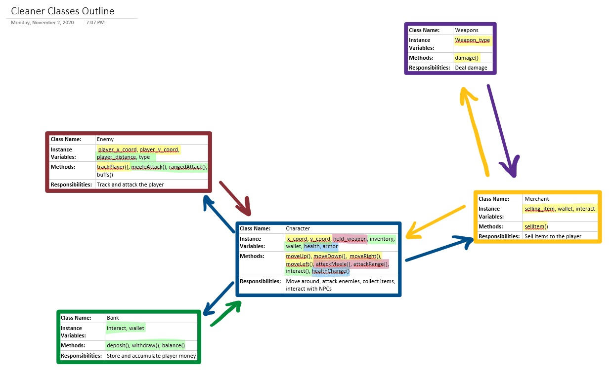

:warning: Everything between << >> needs to be replaced (remove << >> after replacing)

# Ravioli Simulator
## CS 110 Final Project
### Fall, 2020
### [Assignment Description](https://drive.google.com/open?id=1HLIk-539N9KiAAG1224NWpFyEl4RsPVBwtBZ9KbjicE)

https://github.com/bucs110/final-project-fall20-ravioli.git

<< [link to demo presentation slides](#) >>

### Team: Ravioli
#### Emily Greene, Roman Raguso, Josef Schindler

***

## Project Description
Our project is an RPG with a combat and economy system. There are waves of enemies for the character to fight, dealing out melee and range attack. As time passes, the enemies become progressively harder to kill, and the character accumulates money in their bank account. The character can also deposit and withdraw money from the bank to buy different items from merchants. All of the features combine to create an entertaining story for the player.
***    

## User Interface Design
 *
 This is the screen the player sees when they begin the game.
*
This the the screen the player sees while playing the game.
 *
 This is the screen the player sees if they lose the game.
 *
 This is the screen the player sees if they win the game.

    * For example, if your program has a start screen, game screen, and game over screen, you should include a wireframe / screenshot / drawing of each one and a short description of the components
* << You should also have a screenshot of each screen for your final GUI >>

***        

## Program Design
* Non-Standard libraries
    * << You should have a list of any additional libraries or modules used (pygame, request) beyond non-standard python. >>
    * For each additional module you should include
        * url for the module documentation
        * a short description of the module
* Class Interface Design
    * << A simple drawing that shows the class relationships in your code (see below for an example). >>
        *  
    * This does not need to be overly detailed, but should show how your code fits into the Model/View/Controller paradigm.
* Classes
    * Character- moves around, attacks enemies, collects items, interacts with NPCs
    * Enemy- tracks and attacks character
    * Bank- stores and accumulates the character's money
    * Merchant- sells items to character
    * Weapon- Deals damage

***

## Tasks and Responsibilities
* You must outline the team member roles and who was responsible for each class/method, both individual and collaborative.

### Software Lead - Emily Greene

<< Worked as integration specialist by... >>

### Front End Specialist - Roman Raguso

<< Front-end lead conducted significant research on... >>

### Back End Specialist - Josef Schindler

<< The back end specialist... >>

## Testing
* << Describe your testing strategy for your project. >>
    * << Example >>

* Your ATP

| Step                  | Procedure     | Expected Results  | Actual Results |
| ----------------------|:-------------:| -----------------:| -------------- |
|  1  | Run Counter Program  | GUI window appears with count = 0  |          |
|  2  | click count button  | display changes to count = 1 |                 |
etc...