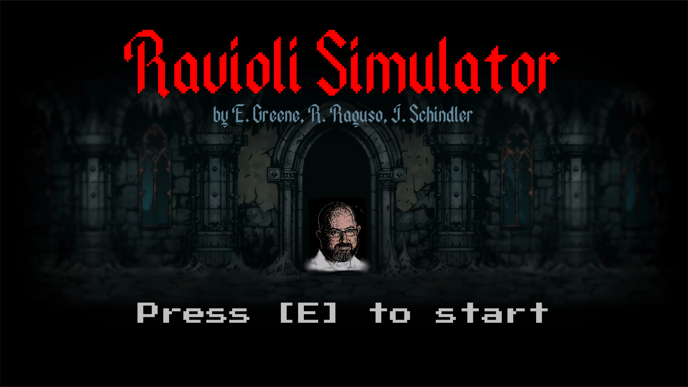
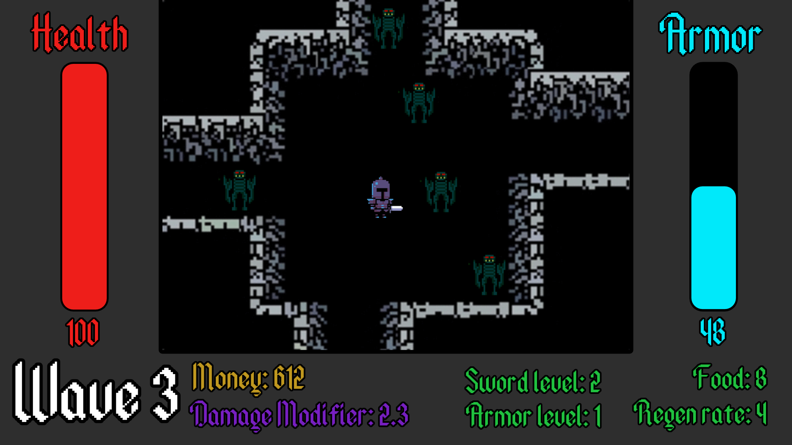
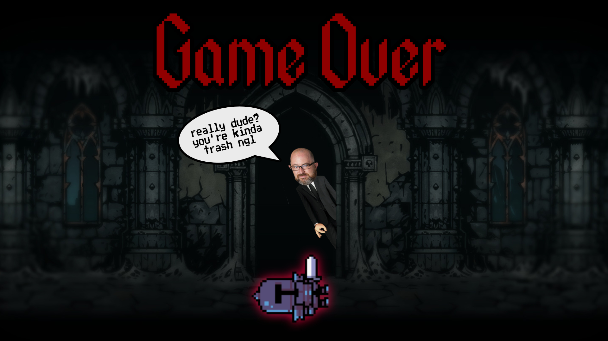
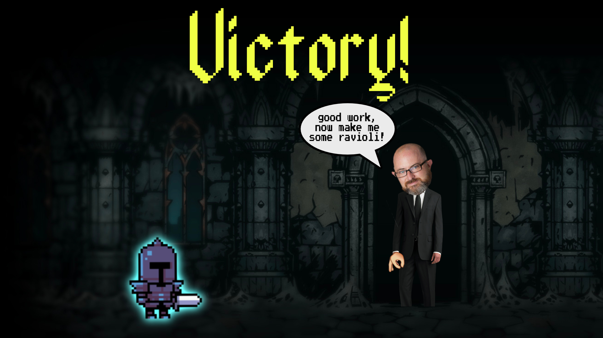
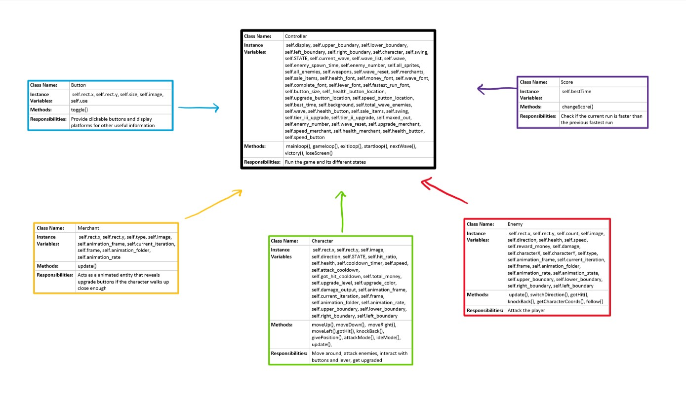

:warning: Everything between << >> needs to be replaced (remove << >> after replacing)

# Ravioli Simulator
## CS 110 Final Project
### Fall, 2020
### [Assignment Description](https://drive.google.com/open?id=1HLIk-539N9KiAAG1224NWpFyEl4RsPVBwtBZ9KbjicE)

https://github.com/bucs110/final-project-fall20-ravioli.git

<< [link to demo presentation slides](#) >>

### Team: Ravioli
#### Emily Greene, Roman Raguso, Josef Schindler

***

## Project Description
Our project is an RPG with a combat and economy system. There are waves of enemies for the character to fight, dealing out melee and range attack. As time passes, the enemies become progressively harder to kill, and the character accumulates money in their bank account. The character can also deposit and withdraw money from the bank to buy different items from merchants. All of the features combine to create an entertaining story for the player.
***    

## User Interface Design
 *
 This is the screen the player sees when they begin the game.
*
This the the screen the player sees while playing the game.
 *
 This is the screen the player sees if they lose the game.
 *
 This is the screen the player sees if they win the game.

* << You should also have a screenshot of each screen for your final GUI >>

***        

## Program Design
* Non-Standard libraries
    * Random
	    * https://docs.python.org/3/library/random.html
	    * The random module is a psuedo-random number generator.
	* Pygame
		* https://www.pygame.org/docs/
		* Pygame is a framework library that handles the view of a program and is designed for writing video games.

* Class Interface Design
        *  
* Classes
    * Character- This is the player that the user controls. It can move around, get hit by an enemy and lose health, and get knocked back after being hit.
    * Enemy- This creates the enemies that the character fights. It can move within the boundaries, change direction, get hit and lose health, and get knocked back after being hit.
    * Functions- This contains two methods- randomDirection determines if the enemy is finished walking and determines a new direction, and makeOppositeDirection changes the direction that the character or enemy is walking in to its opposite direction.
    * Melee- This creates the sword weapon which deals melee damage to the enemies.
    * Controller- This initializes the screen and creates sprite groups for all of the sprites and just the enemies. It establishes the key movements of "w," "a," "s," "d," and the spacebar, which signals for the sword to strike. This allows the enemies to get hit if the rectangles of the sword and the enemy overlap, and it allows the enemies to die. Also, it allows for the detection of the player being hit by the enemies.  If the player is hit, it loses health, and either stays alive and is knocked back or dies.

***

## Tasks and Responsibilities
* You must outline the team member roles and who was responsible for each class/method, both individual and collaborative.

### Software Lead - Emily Greene

<< Worked as integration specialist by... >>

### Front End Specialist - Roman Raguso

<< Front-end lead conducted significant research on... >>

### Back End Specialist - Josef Schindler

<< The back end specialist... >>

## Testing
* << Describe your testing strategy for your project. >>
    * << Example >>

* Your ATP

| Step                  | Procedure     | Expected Results  | Actual Results |
| ----------------------|:-------------:| -----------------:| -------------- |
|  1  | Run Counter Program  | GUI window appears with count = 0  |          |
|  2  | click count button  | display changes to count = 1 |                 |
etc...