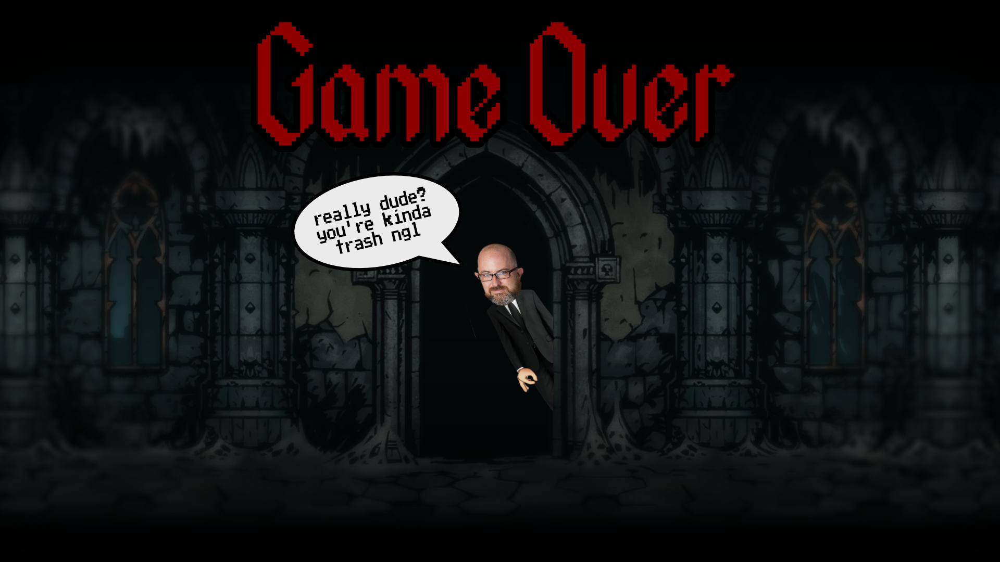

:warning: Everything between << >> needs to be replaced (remove << >> after replacing)

# Ravioli Simulator
## CS 110 Final Project
### Fall, 2020
### [Assignment Description](https://drive.google.com/open?id=1HLIk-539N9KiAAG1224NWpFyEl4RsPVBwtBZ9KbjicE)

https://github.com/bucs110/final-project-fall20-ravioli.git

https://docs.google.com/presentation/d/1GAui5JCBEnaJ_AB3h4D5tnfH_YqFALjKpIkGhKZkrio/edit#slide=id.g33aee8826e_9_16

### Team: Ravioli
#### Emily Greene, Roman Raguso, Josef Schindler

***

## Project Description
Our project is an RPG with a combat and economy system. There are waves of enemies for the character to fight, dealing out melee and range attack. As time passes, the enemies become progressively harder to kill, and the character accumulates money in their bank account. The character can also deposit and withdraw money from the bank to buy different items from merchants. All of the features combine to create an entertaining story for the player.
***    

## User Interface Design
 *
 This is the screen the player sees when they begin the game.
*
This the the screen the player sees while playing the game.
 *
 This is the screen the player sees if they lose the game.
 *
 This is the screen the player sees if they win the game.

* << You should also have a screenshot of each screen for your final GUI >>

***        

## Program Design
* Non-Standard libraries
    * Random
	    * https://docs.python.org/3/library/random.html
	    * The random module is a psuedo-random number generator.
	* Pygame
		* https://www.pygame.org/docs/
		* Pygame is a framework library that handles the view of a program and is designed for writing video games.
	* os
		* https://docs.python.org/3/library/os.html
		* os allows the usage of operating system dependent functionality.

		

* Class Interface Design
        *  
* Classes
    * Character- This is the player that the user controls. It can move around, get hit by an enemy and lose health, and get knocked back after being hit.
    * Enemy- This creates the enemies that the character fights. It can move within the boundaries, change direction, get hit and lose health, and get knocked back after being hit.
    * Melee- This creates the sword weapon which deals melee damage to the enemies. (not currently in use- left in for future repurpose)
    * Button- This creates a button that can be clicked to lead to other information to the player.
    * Merchant- This is a seller that the character can buy goods from.
    * Controller- This initializes the screen and creates sprite groups for all of the sprites and just the enemies. It establishes the key movements of "w," "a," "s," "d," and the spacebar, which signals for the sword to strike. This allows the enemies to get hit if the rectangles of the sword and the enemy overlap, and it allows the enemies to die. Also, it allows for the detection of the player being hit by the enemies.  If the player is hit, it loses health, and either stays alive and is knocked back or dies.

***

## Tasks and Responsibilities
* You must outline the team member roles and who was responsible for each class/method, both individual and collaborative.

### Software Lead - Emily Greene

<< Worked as integration specialist by... >>

### Front End Specialist - Roman Raguso

<< Front-end lead conducted significant research on... >>

### Back End Specialist - Josef Schindler

<< The back end specialist... >>

## Testing
* ****I tested the code at least once a week; however, whenever I saw that new code had been pushed, I pulled it and ran it to ensure it was working properly. I regularly went through the code to make sure I understood it all, that it was all dry, and that it made sense and worked together. As a team, we went through the code twice. I used an exploratory testing method to ensure optimization because it was the most time efficient and, in my opinion, the most true to life way of testing out our game. I mostly played the game to the extent that it was made at the moment and went through each action that was made then. I knew how the game was supposed to be played and the objective of it, so I would go through every action that the character could do, such as moving up/down/left/right, swinging its sword in thin air, swinging its sword to hit an enemy, killing enemies, and dying. I also went through every sound that could be made in the game while it was running to ensure that the sounds came across correctly.****

* Your ATP

| Step                  | Procedure     | Expected Results  | Actual Results |
| ----------------------|:-------------:| -----------------:| -------------- |
|  1  | Run Counter Program  | GUI window appears with count = 0  |          |
|  2  | click count button  | display changes to count = 1 |                 |
etc...