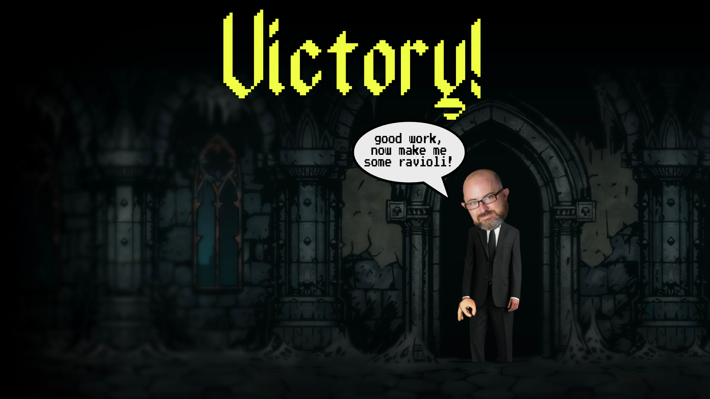

:warning: Everything between << >> needs to be replaced (remove << >> after replacing)

# Ravioli Simulator
## CS 110 Final Project
### Fall, 2020
### [Assignment Description](https://drive.google.com/open?id=1HLIk-539N9KiAAG1224NWpFyEl4RsPVBwtBZ9KbjicE)

https://github.com/bucs110/final-project-fall20-ravioli.git

https://docs.google.com/presentation/d/1GAui5JCBEnaJ_AB3h4D5tnfH_YqFALjKpIkGhKZkrio/edit#slide=id.g33aee8826e_9_16

### Team: Ravioli
#### Emily Greene, Roman Raguso, Josef Schindler

***

## Project Description
Our project is an RPG with a combat and economy system. There are waves of enemies for the character to fight, dealing out melee and range attack. As time passes, the enemies become progressively harder to kill, and the character accumulates money in their bank account. The character can also deposit and withdraw money from the bank to buy different items from merchants. All of the features combine to create an entertaining story for the player.
***    

## User Interface Design
 *
 This is the screen the player sees when they begin the game.
*
This is the screen the player sees while playing the game and fighting enemies.
*
This is the screen the player sees while buying from merchants in-between rounds of gameplay.
 *
 This is the screen the player sees if they lose the game.
 *
 This is the screen the player sees if they win the game.

* << You should also have a screenshot of each screen for your final GUI >>

***        

## Program Design
* Standard libraries
    * Random
	    * https://docs.python.org/3/library/random.html
	    * The random module is a psuedo-random number generator.
	* Pygame
		* https://www.pygame.org/docs/
		* Pygame is a framework library that handles the view of a program and is designed for writing video games.
	* os
		* https://docs.python.org/3/library/os.html
		* os allows the usage of operating system dependent functionality.
	* time
		* https://docs.python.org/3/library/time.html
		* The time module allows the user to use time-related functions.

		

* Class Interface Design
        *  
* Classes
    * Character- This is the knight player that the user controls. It can move around, get hit by an enemy and lose health, get knocked back after being hit, and attack an enemy.
    * Enemy- This creates the different kinds of enemies that the character fights. There are roamer enemies, enemies that move horizontally, and enemies that follow the knight. The enemies can change direction, lose health after being hit, knock back the knight after hitting the knight
    * Melee- This creates the sword weapon which deals melee damage to the enemies (not currently in use- left in for potential future repurpose).
    * Button- This creates a button that can be clicked and toggled after being clicked.
    * Merchant- This is a seller that the knight can buy upgrades from.
    * Controller- This initializes the screen, creates the different game states (start, gameplay, exit, next wave, victory, lose), and creates sprite groups for all of the sprites and just the enemies. It establishes the key movements of "w," "a," "s," "d," "LCTRL" (exits game) and the spacebar (signals for the sword to strike). This allows the enemies to get hit if the rectangles of the sword and the enemy overlap, and it allows the enemies to lose health and die. Also, it allows for the detection of the knight being hit by the enemies.  If the knight is hit, it loses health, and either stays alive and is knocked back or dies. The controller also establishes the wave system of the game; after each round of gameplay, there is another and a more difficult wave of enemies. This class calls for the spawning of the different kinds of enemies dependent on which wave is currently in play. It also spawns merchants and establishes the ability for the knight to buy items, such as speed upgrades, increased damage output and an increase in health, from the merchants after each round of gameplay. This class allows the player to maneuver the knight over the lever on the merchant screen and press "e" to begin the next wave. 

***

## Tasks and Responsibilities
* You must outline the team member roles and who was responsible for each class/method, both individual and collaborative.

### Software Lead - Emily Greene

<< Worked as integration specialist by... >>

### Front End Specialist - Roman Raguso

<< Front-end lead conducted significant research on... >>

### Back End Specialist - Josef Schindler

<< The back end specialist... >>

## Testing
* ****I tested the code at least once a week; however, whenever I saw that new code had been pushed, I pulled it and ran it to ensure it was working properly. I regularly went through the code to make sure I understood it all, that it was all dry, and that it made sense and worked together. As a team, we went through the code twice. I used an exploratory testing method to ensure optimization because it was the most time efficient and, in my opinion, the most true to life way of testing out our game. I mostly played the game to the extent that it was made at the moment and went through each action that was made then. I knew how the game was supposed to be played and the objective of it, so I would go through every action that the character could do, such as moving up/down/left/right, swinging its sword in thin air, swinging its sword to hit an enemy, killing enemies, and dying. I also went through every sound that could be made in the game while it was running to ensure that the sounds came across correctly.****

* Your ATP

| Step                  | Procedure     | Expected Results  | Actual Results |
| ----------------------|:-------------:| -----------------:| -------------- |
|  1  | Press "W" key  | Knight moves up and stays within the screen  |  Knight moves up and stays within the screen         |
|  2  | Press "A" key  | Knight moves left and stays within screen |   Knight moves left and stays within screen              |
|  3  | Press "S" key  | Knight moves down and stays within the screen  | Knight moves down and stays within the screen         |
|  4  | Press "D" key  | Knight moves right and stays within screen |   Knight moves right and stays within screen              |
|  5  | Press spacebar  | Knight swings sword and slashing sound is made  |  Knight swings sword and slashing sound is made        |
|  6  | Press "W" and "A" keys  | Knight moves to the upper left diagonal and stays within screen |  Knight moves to the upper left diagonal and stays within screen               |
|  7  | Press "W" and "D" keys  | Knight moves to the upper right diagonal and stays within the screen  |  Knight moves to the upper right diagonal and stays within the screen        |
|  8  | Press "S" and "A" keys  | Knight moves to the lower left diagonal and stays within screen | Knight moves to the lower left diagonal and stays within screen                |
|  9  | Press "S" and "D" keys  | Knight moves to the lower right diagonal and stays within the screen  | Knight moves to the lower right diagonal and stays within the screen         |
|  10  | Move to within attack range of enemy and press spacebar  | The sword swings, a slashing sound is made, the enemy makes a hissing noise, the enemy bounces back 75 pixels or until it hits the boundary if it is less than 75 pixels away from the boundary, and the enemy loses 10 health points. If the enemy dies, then money count increases by 10. |   The sword swings, a slashing sound is made, the enemy makes a hissing noise, the enemy bounces back 75 pixels or until it hits the boundary if it is less than 75 pixels away from the boundary, and the enemy loses 10 health points. If the enemy dies, then money count increases by 10.         |
|  11  | Enemy comes within attack range of the knight and spacebar is not pressed  | Knight bounces back 75 pixels or until it hits the boundary if it is less than 75 pixels away from the boundary, a hitting noise is made, a splash of purple appears, and the health count decreases by 10.  | night bounces back 75 pixels or until it hits the boundary if it is less than 75 pixels away from the boundary, a hitting noise is made, a splash of purple appears, and the health count decreases by 10.         |
|  12  | Overlap knight with lever on screen with merchants and user presses "E" key  | The lever handle flips, makes a clicking noise, and another round of gameplay with a new wave begins.  |   The lever handle flips, makes a clicking noise, and another round of gameplay with a new wave begins.              |
|  13  | Move knight to within range of yellow wizard on merchant screen until a yellow button pops up | Button for exchange of money for an increase in damage output appears  |  Button for exchange of money for an increase in damage output appears        |
|  14  | Move knight to within range of Red wizard on merchant screen until a red button pops up  | Button for exchange of money for an increase in health appears |   Button for exchange of money for an increase in health appears              |
|  15  | Move knight to within range of blue wizard on merchant screen  until a blue button pops up | Button for exchange of money for an increase in speed appears  |    Button for exchange of money for an increase in speed appears      |
|  16  | Click on button from yellow wizard for the first time  | Money count decreases by 250 and attack damage doubles |    Money count decreases by 250 and attack damage doubles             |
|  17  | Click on button from yellow wizard for the second time  | Money count decreases by 500 and attack damage doubles again |    Money count decreases by 500 and attack damage doubles again            |
|  18  | Click on button from red wizard  | Money count decreases by 10 and health count increases by 10.  |  Money count decreases by 10 and health count increases by 10.        |
|  19  | Click on button from blue wizard  | Money count decreases by 50 and knight is one unit faster  in the next round of gameplay.  | Money count decreases by 50 and knight is one unit faster  in the next round of gameplay.           |
|  20  | Click on button from blue wizard  | Money count decreases by 100 and knight is one more unit faster in the next round of gameplay.  | Money count decreases by 100 and knight is one more unit faster in the next round of gameplay.           |
|  21  | Press "L" key and "control" key at the same time | The game exits.  |   The game exits.       |
|  22  |On the start screen, press the key "E" | The game starts |     The game starts            |
